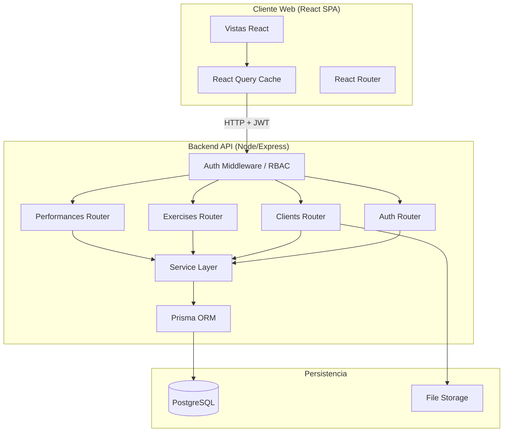
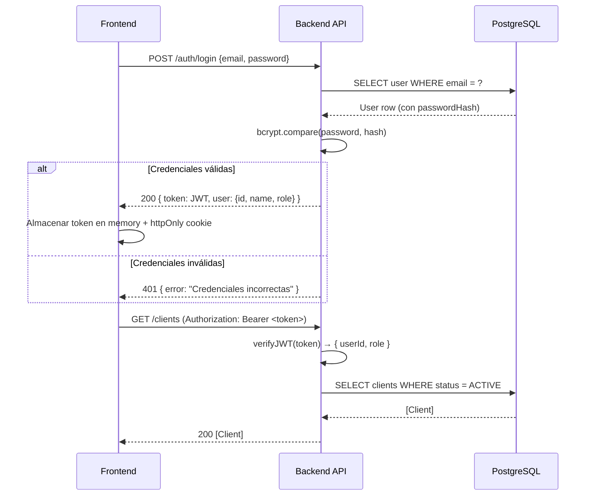

# Design Document — Control de Marcas de Entrenamiento

## Overview

Sistema web interno para centros de entrenamiento personal y gimnasios boutique que centraliza la gestión de clientes y el registro de marcas físicas. La arquitectura sigue el patrón **frontend SPA desacoplado + API REST backend**, lo que permite incorporar en el futuro una app nativa (Android/iOS) y acceso directo de clientes sin reescribir el backend.

### Objetivos de diseño

- MVP funcional centrado en el flujo **Cliente → Ejercicio → Marca actual → Histórico**.
- Backend API stateless con JWT para soportar múltiples tipos de cliente en el futuro.
- Frontend responsive mobile-first que permita registrar marcas desde el móvil en ≤5 interacciones.
- Soft-delete en clientes y ejercicios para preservar la integridad del histórico.
- Control de acceso basado en roles (ADMIN / TRAINER) aplicado en servidor.

### Stack tecnológico

| Capa | Tecnología | Justificación |
|------|-----------|---------------|
| Frontend | **React 18 + TypeScript + Vite** | Ecosistema maduro, excelente soporte TypeScript, build rápido |
| Estilos | **Tailwind CSS** | Utility-first facilita responsive mobile-first sin overhead CSS |
| Estado cliente | **React Query (TanStack Query v5)** | Cache de servidor, sincronización optimista, manejo de loading/error |
| Routing | **React Router v6** | Estándar de facto para SPA React, nested routes |
| Backend | **Node.js + Express + TypeScript** | Ligero, gran ecosistema, fácil despliegue, TypeScript end-to-end |
| ORM | **Prisma** | Migrations tipadas, schema como fuente de verdad, excelente DX |
| Base de datos | **PostgreSQL** | Relacional, ACID, soporta índices en JSON, open-source |
| Autenticación | **JWT (jsonwebtoken) + bcrypt** | Stateless, compatible con clientes nativos futuros |
| Imágenes | **Multer + disco local / S3-compatible** | Sencillo para MVP, intercambiable con S3 en producción |
| Testing BE | **Vitest + Supertest** | Mismo runner que FE, rápido, soporte ESM |
| Testing FE | **Vitest + Testing Library + fast-check** | fast-check para property-based testing |

---

## UI Design System

### Paleta de colores

La interfaz usa una paleta neutra con naranja como color de acción principal, pensada para uso operativo rápido desde el móvil.

| Token | Valor | Uso |
|-------|-------|-----|
| `primary` | `#ED702D` | Botones de acción principal, CTA, enlaces activos |
| `primaryHover` | `#D96424` | Estado hover/pressed de botones primarios |
| `primarySoft` | `#F29A6A` | Badges de marca actual, indicadores de progresión |
| `textPrimary` | `#808080` | Texto principal del cuerpo |
| `textSecondary` | `#A6A6A6` | Texto secundario, labels, metadatos |
| `textMuted` | `#C7C7C7` | Texto desactivado, placeholders |
| `background` | `#FFFFFF` | Fondo general de la aplicación |
| `surface` | `#F5F5F5` | Tarjetas, filas de lista, superficies elevadas |
| `border` | `#DDDDDD` | Bordes de tarjetas, separadores, inputs |

### Configuración Tailwind

La paleta se registra en `tailwind.config.ts` como colores personalizados para poder usarlos con clases de utilidad estándar:

```typescript
// tailwind.config.ts
import type { Config } from 'tailwindcss';

const config: Config = {
  content: ['./src/**/*.{ts,tsx}'],
  theme: {
    extend: {
      colors: {
        primary: {
          DEFAULT: '#ED702D',
          hover: '#D96424',
          soft: '#F29A6A',
        },
        text: {
          primary: '#808080',
          secondary: '#A6A6A6',
          muted: '#C7C7C7',
        },
        background: '#FFFFFF',
        surface: '#F5F5F5',
        border: '#DDDDDD',
      },
    },
  },
  plugins: [],
};

export default config;
```

### Aplicación por componente

- **Botón primario** (Guardar marca, Crear cliente): `bg-primary hover:bg-primary-hover text-white`
- **Tarjeta de cliente** (`ClientCard`): fondo `surface`, borde `border`, texto con `text-primary`
- **Marca actual** (`ExerciseRow`): valor resaltado con `text-primary` o badge en `primary-soft`
- **Campos de formulario**: borde `border`, placeholder con `text-muted`, label con `text-secondary`
- **Fondo de página**: `background` (#FFFFFF)
- **Separadores y líneas**: `border` (#DDDDDD)

---

## Architecture

### Diagrama de alto nivel



### Principios de arquitectura

1. **Separación de capas**: Router → Middleware → Service → Repository (Prisma). Los routers no contienen lógica de negocio.
2. **Stateless API**: El servidor no almacena estado de sesión; toda la información de identidad viaja en el JWT.
3. **RBAC en servidor**: El middleware de autorización verifica el rol extraído del JWT antes de despachar al service. El frontend solo oculta elementos UI como UX, no como seguridad.
4. **Soft-delete**: `status: ACTIVE | INACTIVE` en clientes y ejercicios. Nunca se borran registros físicamente.
5. **Current_Mark como consulta**: No se almacena como campo separado; se obtiene dinámicamente como el PerformanceRecord con la fecha más reciente para cada par (clientId, exerciseId).

### Flujo de autenticación



---

## Components and Interfaces

### Backend: estructura de módulos

```
backend/
├── src/
│   ├── index.ts                  # Punto de entrada, configuración Express
│   ├── prisma/
│   │   └── client.ts             # Instancia singleton de PrismaClient
│   ├── middleware/
│   │   ├── authenticate.ts       # Verifica JWT, adjunta req.user
│   │   └── authorize.ts          # Verifica rol mínimo requerido
│   ├── modules/
│   │   ├── auth/
│   │   │   ├── auth.router.ts
│   │   │   └── auth.service.ts
│   │   ├── clients/
│   │   │   ├── clients.router.ts
│   │   │   └── clients.service.ts
│   │   ├── exercises/
│   │   │   ├── exercises.router.ts
│   │   │   └── exercises.service.ts
│   │   └── performances/
│   │       ├── performances.router.ts
│   │       └── performances.service.ts
│   └── types/
│       └── express.d.ts          # Extensión de Request con req.user
```

### API REST — endpoints

Todos los endpoints (excepto `/auth/login`) requieren `Authorization: Bearer <token>`.

#### Autenticación

| Método | Ruta | Rol | Descripción |
|--------|------|-----|-------------|
| POST | `/auth/login` | — | Obtener JWT |
| POST | `/auth/logout` | Any | Invalidar token (blacklist o client-side) |
| GET | `/auth/me` | Any | Datos del usuario autenticado |

#### Clientes

| Método | Ruta | Rol | Descripción |
|--------|------|-----|-------------|
| GET | `/clients` | Any | Listado de clientes activos (con búsqueda `?q=`) |
| POST | `/clients` | ADMIN | Crear cliente |
| GET | `/clients/:id` | Any | Obtener cliente por ID |
| PUT | `/clients/:id` | ADMIN | Editar cliente completo |
| PATCH | `/clients/:id/status` | ADMIN | Cambiar estado ACTIVE/INACTIVE |
| POST | `/clients/:id/photo` | ADMIN | Subir/actualizar foto |

#### Ejercicios

| Método | Ruta | Rol | Descripción |
|--------|------|-----|-------------|
| GET | `/exercises` | Any | Listado de ejercicios (activos por defecto) |
| POST | `/exercises` | ADMIN | Crear ejercicio |
| GET | `/exercises/:id` | Any | Obtener ejercicio por ID |
| PUT | `/exercises/:id` | ADMIN | Editar ejercicio completo |
| PATCH | `/exercises/:id/status` | ADMIN | Cambiar estado ACTIVE/INACTIVE |

#### Marcas (Performances)

| Método | Ruta | Rol | Descripción |
|--------|------|-----|-------------|
| GET | `/clients/:clientId/current-performances` | Any | Current_Mark de todos los ejercicios activos del cliente |
| GET | `/clients/:clientId/exercises/:exerciseId/performances` | Any | Histórico de un cliente en un ejercicio |
| POST | `/clients/:clientId/exercises/:exerciseId/performances` | Any | Crear nueva marca |

### Frontend: estructura de páginas

```
frontend/
├── src/
│   ├── main.tsx
│   ├── App.tsx                   # Router root, rutas protegidas
│   ├── api/                      # Funciones fetch hacia la API (axios/fetch)
│   │   ├── auth.ts
│   │   ├── clients.ts
│   │   ├── exercises.ts
│   │   └── performances.ts
│   ├── hooks/                    # React Query hooks
│   │   ├── useClients.ts
│   │   ├── useExercises.ts
│   │   └── usePerformances.ts
│   ├── components/               # Componentes reutilizables
│   │   ├── ProtectedRoute.tsx
│   │   ├── ClientCard.tsx
│   │   ├── ExerciseRow.tsx
│   │   ├── PerformanceForm.tsx
│   │   └── Avatar.tsx
│   └── pages/
│       ├── LoginPage.tsx
│       ├── DashboardPage.tsx
│       ├── ClientProfilePage.tsx
│       ├── ExerciseHistoryPage.tsx
│       ├── admin/
│       │   ├── ClientsAdminPage.tsx
│       │   └── ExercisesAdminPage.tsx
│       └── NotFoundPage.tsx
```

### Interfaces TypeScript compartidas (tipos canónicos)

```typescript
// Roles
type Role = 'ADMIN' | 'TRAINER';

// Usuario autenticado (payload JWT)
interface JwtPayload {
  sub: string;      // userId
  role: Role;
  iat: number;
  exp: number;
}

// Respuesta de login
interface LoginResponse {
  token: string;
  user: { id: string; name: string; email: string; role: Role };
}

// Cliente
interface Client {
  id: string;
  firstName: string;
  lastName: string;
  birthDate: string;          // ISO 8601
  height?: number;            // cm
  weight?: number;            // kg
  bodyFatPercentage?: number;
  photoUrl?: string;
  notes?: string;
  status: 'ACTIVE' | 'INACTIVE';
  createdAt: string;
  updatedAt: string;
}

// Ejercicio
interface Exercise {
  id: string;
  name: string;
  category: string;
  defaultUnit: string;
  description?: string;
  status: 'ACTIVE' | 'INACTIVE';
  createdAt: string;
  updatedAt: string;
}

// Unidades permitidas para el valor principal de una marca
type PerformanceUnit = 'kg' | 'repetitions' | 'seconds' | 'minutes' | 'meters' | 'calories' | 'text';

// Registro de marca
interface PerformanceRecord {
  id: string;
  clientId: string;
  exerciseId: string;
  trainerId: string;
  trainerName: string;        // Nombre del trainer (JOIN en consulta)
  value: number | string;     // number para unidades numéricas, string para 'text'
  unit: PerformanceUnit;
  weight?: number;
  repetitions?: number;
  duration?: number;
  distance?: number;
  date: string;               // ISO 8601
  notes?: string;
  createdAt: string;
  updatedAt: string;
}

// Current mark por ejercicio (para el perfil del cliente)
interface CurrentMark {
  exerciseId: string;
  exerciseName: string;
  record: PerformanceRecord | null;
}
```

---

## Data Models

### Esquema Prisma

```prisma
// schema.prisma

generator client {
  provider = "prisma-client-js"
}

datasource db {
  provider = "postgresql"
  url      = env("DATABASE_URL")
}

enum Role {
  ADMIN
  TRAINER
}

enum Status {
  ACTIVE
  INACTIVE
}

enum PerformanceUnit {
  kg
  repetitions
  seconds
  minutes
  meters
  calories
  text
}

model User {
  id           String   @id @default(uuid())
  name         String
  email        String   @unique
  passwordHash String
  role         Role
  active       Boolean  @default(true)
  createdAt    DateTime @default(now())
  updatedAt    DateTime @updatedAt

  performances PerformanceRecord[]

  @@map("users")
}

model Client {
  id                String   @id @default(uuid())
  firstName         String
  lastName          String
  birthDate         DateTime
  height            Float?
  weight            Float?
  bodyFatPercentage Float?
  photoUrl          String?
  notes             String?
  status            Status   @default(ACTIVE)
  createdAt         DateTime @default(now())
  updatedAt         DateTime @updatedAt

  performances PerformanceRecord[]

  @@map("clients")
}

model Exercise {
  id          String          @id @default(uuid())
  name        String
  category    String
  defaultUnit PerformanceUnit
  description String?
  status      Status          @default(ACTIVE)
  createdAt   DateTime        @default(now())
  updatedAt   DateTime        @updatedAt

  performances PerformanceRecord[]

  @@map("exercises")
}

model PerformanceRecord {
  id          String          @id @default(uuid())
  clientId    String
  exerciseId  String
  trainerId   String
  value       Float           // Para unidades de tipo 'text', se almacena 0 y se usa notes
  unit        PerformanceUnit
  weight      Float?
  repetitions Int?
  duration    Float?
  distance    Float?
  date        DateTime
  notes       String?
  createdAt   DateTime        @default(now())
  updatedAt   DateTime        @updatedAt

  client   Client   @relation(fields: [clientId], references: [id])
  exercise Exercise @relation(fields: [exerciseId], references: [id])
  trainer  User     @relation(fields: [trainerId], references: [id])

  @@index([clientId, exerciseId, date(sort: Desc)])
  @@map("performance_records")
}
```

### Decisiones de diseño del modelo de datos

1. **Current_Mark como consulta dinámica**: En lugar de desnormalizar un campo `currentMarkId` en `Client`, la Current_Mark se obtiene con `ORDER BY date DESC LIMIT 1` filtrado por `(clientId, exerciseId)`. El índice compuesto `(clientId, exerciseId, date DESC)` garantiza rendimiento O(log n).

2. **Unidad `text` en PerformanceRecord**: Para marcas de tipo texto libre (e.g., "sin dolor lumbar"), `value` almacena `0` y el texto va en `notes`. Esta decisión simplifica el schema manteniendo `value` como `Float`.

3. **Soft-delete via `status`**: Clientes y ejercicios nunca se borran. Los `PerformanceRecord` siempre quedan intactos independientemente del estado del cliente o ejercicio.

4. **`trainerId` auditado en servidor**: El `trainerId` se extrae del JWT en el middleware y se inyecta desde el service; el cliente nunca puede especificarlo.

5. **UUIDs como identificadores**: Se usan `uuid()` de PostgreSQL para evitar IDs secuenciales predecibles en la API pública.

---

## Cumplimiento RGPD / LOPD

### Contexto normativo

Los datos almacenados incluyen **datos de salud** (peso, altura, % de grasa corporal), que bajo el RGPD (Reglamento UE 2016/679) y la LOPDGDD (LO 3/2018) son **datos de categoría especial** (Art. 9 RGPD). El tratamiento requiere base jurídica explícita — en este caso, la relación contractual entre el cliente y el centro de entrenamiento.

### Implicaciones en el modelo de datos

#### Anonimización (derecho de supresión — Art. 17 RGPD)

El soft-delete original (`status: INACTIVE`) no es suficiente para atender una solicitud de supresión. Se introduce el campo `anonymizedAt` en `Client`:

```prisma
model Client {
  // ... campos existentes ...
  anonymizedAt DateTime?   // NULL = no anonimizado; fecha = anonimizado en esa fecha
}
```

Cuando un cliente ejerce el derecho de supresión:
- `firstName` → `"ANONIMIZADO"`
- `lastName` → `""`
- `birthDate` → fecha genérica (`1900-01-01`)
- `photoUrl` → `NULL` + borrado físico del archivo
- `notes` → `NULL`
- `anonymizedAt` → timestamp de la operación
- Los `PerformanceRecord` se **conservan** con el `clientId` intacto (datos disociados de identidad, válidos para estadísticas internas).

#### Log de auditoría

Se añade un modelo `AuditLog` para registrar accesos y modificaciones de datos personales:

```prisma
model AuditLog {
  id         String   @id @default(uuid())
  userId     String                        // Quién realizó la acción
  action     String                        // 'READ' | 'CREATE' | 'UPDATE' | 'ANONYMIZE' | 'EXPORT'
  entityType String                        // 'Client' | 'PerformanceRecord'
  entityId   String                        // ID del registro afectado
  metadata   Json?                         // Campos modificados (sin valores sensibles)
  createdAt  DateTime @default(now())

  user User @relation(fields: [userId], references: [id])

  @@index([entityType, entityId])
  @@index([userId, createdAt])
  @@map("audit_logs")
}
```

#### Portabilidad de datos (Art. 20 RGPD)

El endpoint `GET /clients/:id/export` (solo ADMIN) devuelve un JSON con todos los datos personales del cliente y su histórico completo, en formato legible y descargable.

#### Consentimiento para foto

El campo `photoConsentAt` en `Client` registra cuándo se obtuvo el consentimiento explícito para almacenar la foto:

```prisma
model Client {
  // ... campos existentes ...
  photoConsentAt DateTime?   // NULL = sin foto o sin consentimiento registrado
}
```

La foto solo puede subirse si `photoConsentAt` tiene valor. El endpoint `DELETE /clients/:id/photo` borra el archivo físico y pone `photoUrl = NULL` y `photoConsentAt = NULL`.

### Endpoints adicionales por RGPD

| Método | Ruta | Rol | Descripción |
|--------|------|-----|-------------|
| GET | `/clients/:id/export` | ADMIN | Exportar todos los datos del cliente (portabilidad) |
| POST | `/clients/:id/anonymize` | ADMIN | Anonimizar datos de identidad (supresión) |
| DELETE | `/clients/:id/photo` | ADMIN | Borrar foto y revocar consentimiento |

### Principios aplicados

| Principio RGPD | Implementación |
|----------------|----------------|
| **Minimización** | Solo se almacenan campos justificables para la prestación del servicio de entrenamiento |
| **Integridad y confidencialidad** | Contraseñas con bcrypt, JWT con expiración, HTTPS obligatorio en producción |
| **Responsabilidad proactiva** | `AuditLog` registra todas las operaciones sobre datos personales |
| **Derecho de supresión** | Anonimización en lugar de borrado para preservar integridad referencial |
| **Derecho de portabilidad** | Endpoint de exportación JSON |
| **Consentimiento para foto** | Campo `photoConsentAt` requerido antes de subir imagen |

> **Nota**: Este diseño técnico facilita el cumplimiento normativo, pero no sustituye la redacción de la política de privacidad, el registro de actividades de tratamiento (Art. 30 RGPD) ni el eventual nombramiento de DPO, que son obligaciones organizativas del centro.

---

## Correctness Properties

*Una propiedad es una característica o comportamiento que debe mantenerse en todas las ejecuciones válidas del sistema — esencialmente, una afirmación formal sobre lo que el sistema debe hacer. Las propiedades sirven como puente entre las especificaciones legibles por humanos y las garantías de corrección verificables por máquina.*

### Property 1: Filtro de búsqueda de clientes es inclusivo y case-insensitive

*Para cualquier* lista de clientes activos y cualquier texto de búsqueda no vacío, todos los clientes devueltos por el filtro deben contener el texto introducido en su nombre o apellidos (ignorando mayúsculas/minúsculas), y ningún cliente cuyo nombre y apellidos no contengan el texto debe aparecer en los resultados.

**Validates: Requirements 2.2, 2.3**

---

### Property 2: Current_Mark es siempre el registro más reciente

*Para cualquier* conjunto de PerformanceRecords de un cliente en un ejercicio, la Current_Mark devuelta por la API debe ser el registro con la fecha más reciente entre todos los registros del par (clientId, exerciseId).

**Validates: Requirements 4.2, 5.1**

---

### Property 3: Creación de marca preserva el histórico

*Para cualquier* cliente y ejercicio, al crear un nuevo PerformanceRecord el número total de registros históricos para ese par (clientId, exerciseId) debe incrementarse exactamente en uno, y todos los registros anteriores deben permanecer inalterados.

**Validates: Requirements 4.3**

---

### Property 4: Histórico ordenado de más reciente a más antiguo

*Para cualquier* conjunto de PerformanceRecords de un cliente en un ejercicio, el histórico devuelto por la API debe estar ordenado de forma que para todo par de registros consecutivos (r_i, r_{i+1}), `r_i.date >= r_{i+1}.date`.

**Validates: Requirements 5.1**

---

### Property 5: Marca rechazada sin campos obligatorios

*Para cualquier* solicitud de creación de PerformanceRecord que omita `value` o `unit`, el sistema debe rechazar la solicitud con un error y el número de registros en la base de datos no debe cambiar.

**Validates: Requirements 4.6**

---

### Property 6: Control de acceso TRAINER no puede hacer operaciones de ADMIN

*Para cualquier* solicitud de creación, edición o cambio de estado de un Client o Exercise realizada por un usuario con rol TRAINER, el sistema debe devolver un código de error de autorización y el estado de la base de datos debe permanecer sin cambios.

**Validates: Requirements 6.5, 7.5, 8.2, 8.4**

---

### Property 7: El trainerId de un PerformanceRecord coincide con el usuario autenticado

*Para cualquier* PerformanceRecord creado exitosamente, el `trainerId` almacenado debe ser igual al `userId` del token JWT usado en la solicitud, independientemente de cualquier valor que el cliente intente enviar en el cuerpo de la petición.

**Validates: Requirements 4.5, 8.5**

---

### Property 8: Ejercicios inactivos excluidos de listados y Current_Mark

*Para cualquier* ejercicio con estado INACTIVE, dicho ejercicio no debe aparecer en la lista de ejercicios del perfil del cliente ni en el resultado de Current_Mark del cliente.

**Validates: Requirements 7.7**

---

## Error Handling

### Estrategia general

| Situación | Código HTTP | Respuesta |
|-----------|------------|-----------|
| Credenciales incorrectas | 401 | `{ error: "Credenciales incorrectas" }` |
| Token ausente o inválido | 401 | `{ error: "No autenticado" }` |
| Token expirado | 401 | `{ error: "Sesión expirada" }` |
| Rol insuficiente | 403 | `{ error: "Permisos insuficientes" }` |
| Recurso no encontrado | 404 | `{ error: "Recurso no encontrado" }` |
| Campos requeridos faltantes | 400 | `{ error: "...", fields: ["campo1"] }` |
| Error interno del servidor | 500 | `{ error: "Error interno del servidor" }` |

### Principios

1. **No revelar información sensible**: Los errores 401 de autenticación no indican si el email existe o si la contraseña es incorrecta (Req 1.2).
2. **Validación en capa de servicio**: Los servicios validan la existencia de recursos referenciados (clientId, exerciseId) antes de crear registros.
3. **Middleware de errores centralizado**: Express usa un error handler global que normaliza todos los errores a la estructura `{ error: string, fields?: string[] }`.
4. **Frontend con feedback claro**: React Query proporciona los estados `isLoading`, `isError` y `error` que el frontend usa para mostrar mensajes al usuario sin crashear.
5. **Logs estructurados en backend**: Todos los errores 5xx se registran con stack trace en servidor (no se exponen al cliente).

---

## Testing Strategy

### Enfoque dual: tests de ejemplo + tests de propiedad

#### Backend — Vitest + Supertest + fast-check

Los tests de backend se organizan en tres niveles:

**1. Tests unitarios de servicio** (Vitest, con Prisma mockeado)
- Cubren lógica de negocio pura: cálculo de Current_Mark, validación de campos, construcción de consultas.
- Casos concretos: creación de marca válida, rechazo de marca sin `value`, rechazo de TRAINER en operaciones ADMIN.

**2. Tests de propiedad** (Vitest + fast-check, con Prisma mockeado)
- Ejecutan mínimo **100 iteraciones** por propiedad.
- Cada test referencia su propiedad del diseño con el tag: `// Feature: control-marcas-entrenamiento, Property N: <texto>`.
- Propiedades implementadas:
  - Property 1: Filtro case-insensitive
  - Property 2: Current_Mark = registro más reciente
  - Property 3: Creación de marca incrementa histórico en 1
  - Property 4: Histórico ordenado DESC
  - Property 5: Rechazo de marca sin campos obligatorios
  - Property 6: TRAINER bloqueado en operaciones ADMIN
  - Property 7: trainerId = userId del JWT
  - Property 8: Ejercicios INACTIVE excluidos de listados

**3. Tests de integración** (Supertest contra base de datos de test)
- Flujo completo de autenticación (login → token → petición autenticada).
- CRUD de clientes y ejercicios end-to-end.
- Creación de marca y verificación de Current_Mark en la respuesta del perfil.
- Se ejecutan con una base de datos PostgreSQL de test (contenedor Docker o instancia CI).

#### Frontend — Vitest + Testing Library

- Tests de componentes para `PerformanceForm`, `ClientCard`, `Avatar`.
- Tests de las funciones de filtrado en `useClients` (búsqueda de clientes).
- Mock de React Query para tests de páginas.
- No se implementan tests de propiedad en frontend para este MVP (la lógica compleja reside en el backend).

#### Configuración de property-based testing

```typescript
// Ejemplo de configuración fast-check para Property 2
import fc from 'fast-check';
import { test, expect } from 'vitest';
import { getCurrentMark } from '../performances.service';

// Feature: control-marcas-entrenamiento, Property 2: Current_Mark is always the most recent record
test('Property 2: Current_Mark es el registro más reciente', () => {
  fc.assert(
    fc.property(
      fc.array(
        fc.record({
          id: fc.uuid(),
          date: fc.date({ min: new Date('2020-01-01'), max: new Date('2030-01-01') }),
          value: fc.float({ min: 0, max: 1000 }),
          unit: fc.constantFrom('kg', 'repetitions', 'seconds', 'minutes', 'meters', 'calories'),
        }),
        { minLength: 1 }
      ),
      (records) => {
        const currentMark = getCurrentMark(records);
        const maxDate = new Date(Math.max(...records.map(r => r.date.getTime())));
        expect(new Date(currentMark.date).getTime()).toBe(maxDate.getTime());
      }
    ),
    { numRuns: 100 }
  );
});
```

#### Cobertura objetivo

| Área | Tipo de test | Cobertura objetivo |
|------|-------------|-------------------|
| Lógica de servicios | Unitario + Propiedad | >90% |
| Endpoints API | Integración | Todos los endpoints principales |
| Control de acceso | Propiedad + Integración | 100% de rutas protegidas |
| Componentes React | Testing Library | Componentes con lógica no trivial |
