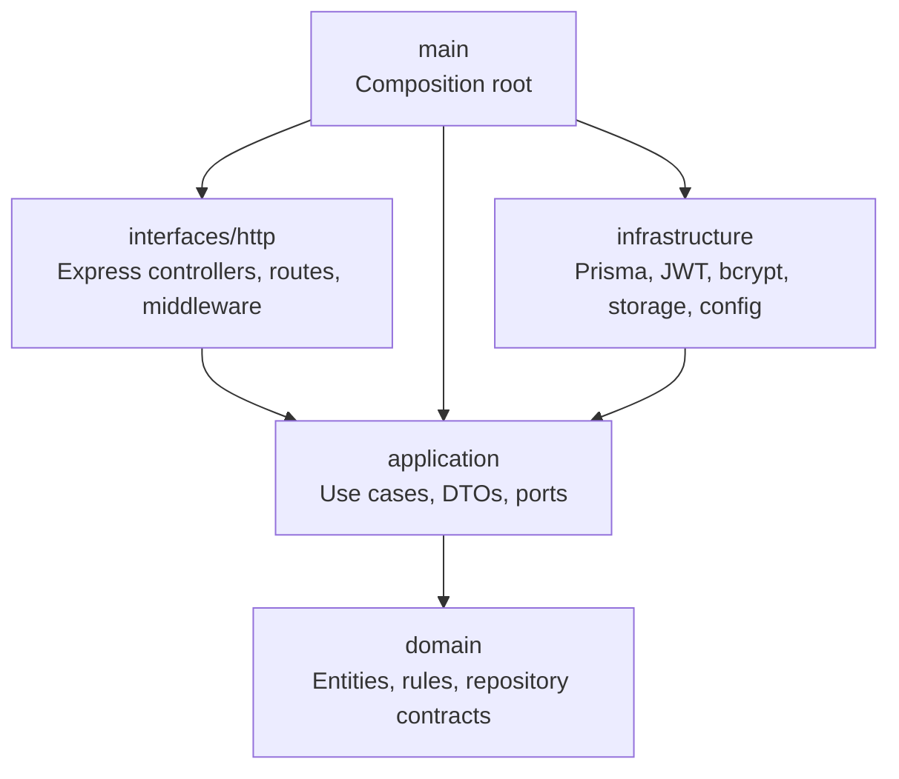
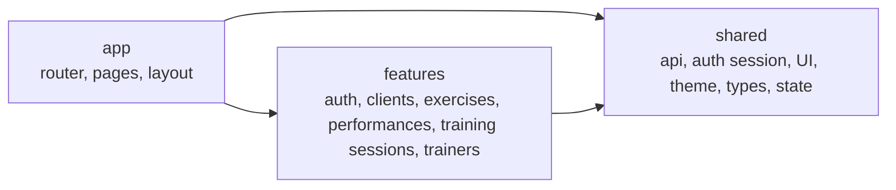

# 🏋️ MyWorkoutBox

MyWorkoutBox es una aplicación web para centros de entrenamiento que necesitan gestionar clientes, entrenadores, ejercicios evaluables y marcas de rendimiento desde una plataforma propia.

El proyecto nace como un producto real orientado a entrenadores personales y centros fitness: centraliza el seguimiento de clientes, permite registrar progresos por ejercicio y mantiene un histórico consultable para tomar mejores decisiones de entrenamiento.

## 🌐 Demo

- Aplicación: [https://tumeta.danielferrandez.dev](https://tumeta.danielferrandez.dev)
- Administrador: `admin-demo@gym.com` / `Admin1234!`
- Entrenador: `trainer-demo@gym.com` / `Trainer1234!`

Las cuentas utilizan datos de demostración y permiten revisar los flujos disponibles para cada rol.

## ✨ Funcionalidades

- Autenticación con JWT y control de acceso por roles.
- Roles principales: administrador y entrenador.
- Multitenancy por centro, con branding configurable por tenant.
- Gestión de clientes: alta, edición, estado activo/inactivo y ficha individual.
- Gestión de entrenadores: alta, estado y cambio de contraseña.
- Catálogo de ejercicios evaluables con plantillas de medición.
- Sesiones de entrenamiento individuales, iniciadas por el entrenador sin planificación previa.
- Incorporación dinámica de ejercicios y registro rápido de varias series por ejercicio.
- Edición y eliminación de series durante la sesión, con numeración automática y cierre inmutable.
- Registro de marcas y rendimiento vinculado a cada sesión, cliente y ejercicio.
- Histórico de progreso y cálculo de marca actual.
- Histórico y detalle de sesiones completadas por cliente.
- Panel administrador y vista operativa para entrenadores.
- RGPD básico: exportación de datos y anonimización.
- Auditoría de acciones relevantes.
- Preparación para producción con MySQL/MariaDB, CORS configurable y despliegue por tags.
- Documentación OpenAPI/Swagger para consumir la API desde otros clientes.

## 🧱 Stack Tecnológico

### 🎨 Frontend

- React 18
- Vite
- TypeScript
- Tailwind CSS
- React Router
- TanStack Query
- Axios
- Lucide React
- Vitest + Testing Library

### ⚙️ Backend

- Node.js
- Express
- TypeScript
- Prisma ORM
- MySQL/MariaDB
- JWT
- bcrypt
- Vitest + Supertest
- OpenAPI 3.0

### 🚀 Infraestructura

- GitHub Actions
- Docker y Docker Compose
- Servidor Linux/VPS
- MariaDB 10.11 con volumen persistente
- Nginx para frontend, proxy de API y fallback SPA

## 🏛️ Arquitectura

El backend sigue una Clean Architecture estricta: las reglas de dominio y los casos de uso no dependen de Express, Prisma, JWT, bcrypt, filesystem ni variables de entorno. Esas dependencias quedan confinadas en infraestructura o adaptadores HTTP.



Regla principal:

```txt
domain <- application <- infrastructure/interfaces/main
```

El frontend usa una arquitectura por módulos funcionales. `app` compone rutas, providers y layout; `features` agrupa capacidades de negocio; `shared` contiene piezas reutilizables sin dependencia de features.



También existen tests de arquitectura para evitar regresiones:

- Backend: `backend/src/architecture-clean-boundaries.test.ts`
- Frontend: `frontend/src/architecture-feature-boundaries.test.ts`

## 📁 Estructura del proyecto

```txt
.
├── backend/
│   ├── prisma/                  # Schema, migraciones, seed y scripts de migración
│   └── src/
│       ├── domain/              # Reglas puras y contratos internos
│       ├── application/         # Casos de uso y puertos
│       ├── infrastructure/      # Prisma, seguridad y adaptadores externos
│       ├── interfaces/http/     # Express, rutas, middlewares y controladores
│       ├── main/                # Composition root
│       └── modules/             # Tests/compatibilidad de módulos existentes
├── frontend/
│   └── src/
│       ├── app/                 # Router, pages y layout de aplicación
│       ├── features/            # Auth, clientes, ejercicios, marcas, sesiones y entrenadores
│       ├── shared/              # UI, API client, theme, state, tipos y sesión
│       └── test/                # Setup de tests frontend
├── .github/workflows/           # CI/CD
├── scripts/                     # Scripts de despliegue y comprobación de servidor
└── doc/                         # Documentación técnica adicional
    ├── DEPLOYMENT.md            # Guía detallada de despliegue
    └── QUALITY.md               # Auditoría y quality gates
```

## 🛠️ Instalación Local

### Requisitos

- Docker Desktop o Docker Engine con Compose.

### 1. Configurar el entorno

```bash
cp .env.docker.example .env.docker
```

Las credenciales del ejemplo son exclusivamente locales. Deben sustituirse en cualquier servidor compartido o productivo.

### 2. Levantar la aplicación

```bash
docker compose --env-file .env.docker up --build -d
```

Compose crea MariaDB, aplica las migraciones y levanta backend y frontend respetando sus health checks.

### 3. Cargar datos demo

```bash
docker compose --env-file .env.docker --profile tools run --rm seed
```

La aplicación queda disponible en `http://localhost:8080`. La API, OpenAPI y Swagger se sirven respectivamente en `/api`, `/api/openapi.json` y `/api/docs`.

Los datos permanecen al ejecutar `docker compose down`. No uses `down -v` salvo que quieras eliminar la base local.

### Desarrollo sin Docker

Para ejecutar Node y Vite directamente se necesitan Node.js 20 o superior, npm y MySQL/MariaDB:

```bash
cp backend/.env.example backend/.env
cp backend/.env.test.example backend/.env.test
cp frontend/.env.example frontend/.env
npm --prefix backend install
npm --prefix frontend install
npm --prefix backend run prisma:generate
npm --prefix backend run prisma:migrate
npm --prefix backend run prisma:seed
```

### 5. Levantar la aplicación

Terminal 1:

```bash
npm --prefix backend run dev
```

Terminal 2:

```bash
npm --prefix frontend run dev
```

Por defecto:

- API: `http://localhost:3000`
- Frontend: `http://localhost:5173`
- Health check: `http://localhost:3000/health`
- OpenAPI JSON: `http://localhost:3000/openapi.json`
- Swagger UI: `http://localhost:3000/docs`

## 🧰 Comandos Útiles

### Backend

```bash
npm --prefix backend install
npm --prefix backend run dev
npm --prefix backend run build
npm --prefix backend test
npm --prefix backend run prisma:generate
npm --prefix backend run prisma:migrate
npm --prefix backend run prisma:seed
```

### Frontend

```bash
npm --prefix frontend install
npm --prefix frontend run dev
npm --prefix frontend run build
npm --prefix frontend test
```

## ✅ Testing

Ejecuta la batería completa antes de mergear o desplegar:

```bash
npm --prefix backend test
npm --prefix backend run build
npm --prefix frontend test
npm --prefix frontend run build
```

Los tests de backend necesitan una base MySQL/MariaDB accesible desde `DATABASE_URL`, normalmente `myworkoutbox_test` en local o una base de test en CI.

La cobertura actual combina:

- Tests unitarios de casos de uso.
- Tests de servicios y flujos HTTP.
- Tests de RGPD, roles, tenants y auditoría.
- Tests de componentes frontend.
- Tests de límites arquitectónicos en backend y frontend.

## 🚢 Despliegue

El despliegue usa el mismo stack Docker Compose en local y en un servidor Linux/VPS. MariaDB, backend y frontend se ejecutan en contenedores, y el reverse proxy público reenvía tráfico al Nginx local.

Flujo recomendado:

```txt
branch local -> merge a main -> tag de release -> push del tag
  -> GitHub Actions ejecuta quality gates y construye imágenes
  -> despliegue por SSH al VPS
  -> backup de MariaDB
  -> migraciones y recreación con Docker Compose
  -> health checks y rollback de aplicación si falla
```

Para la configuración del servidor, primera migración, GitHub Secrets, backups, restauración y rollback, consulta [DEPLOYMENT.md](./doc/DEPLOYMENT.md).
