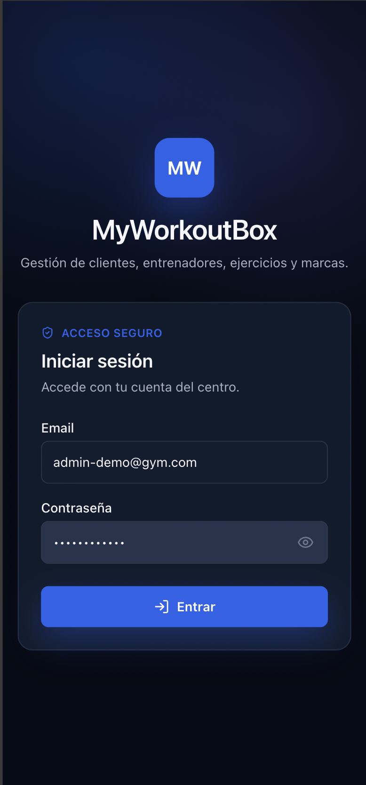
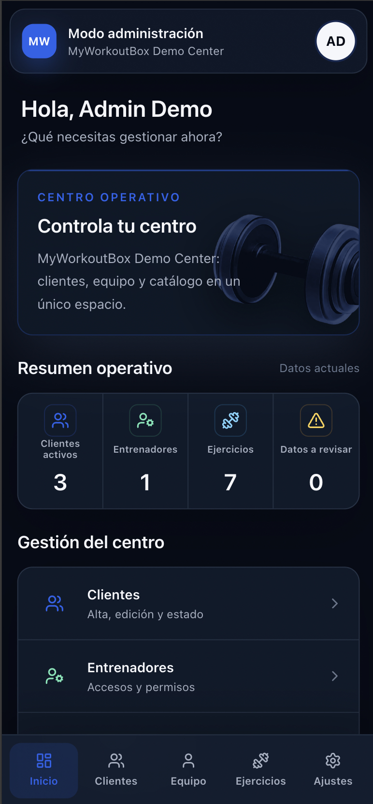
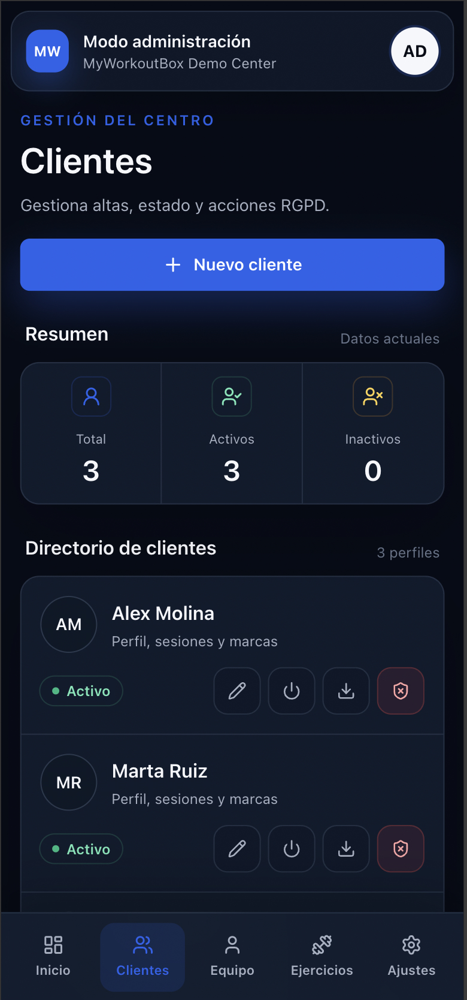
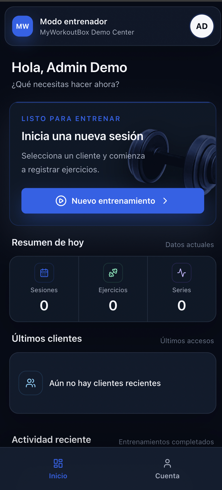
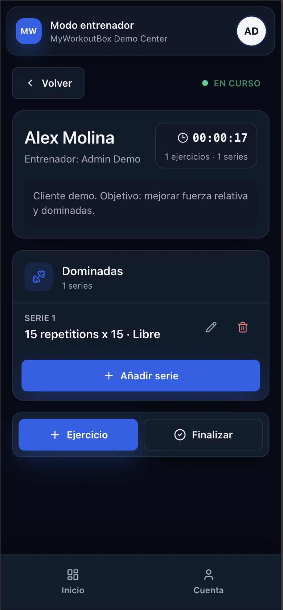
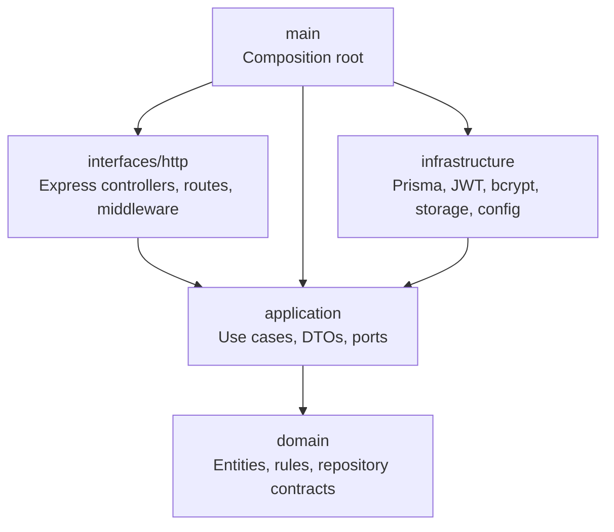
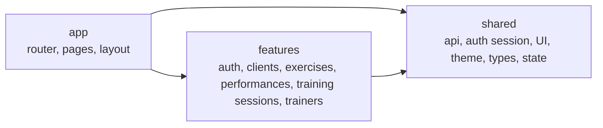

# 🏋️ MyWorkoutBox

**MyWorkoutBox** es una aplicación web para centros de entrenamiento que necesitan gestionar clientes, entrenadores, ejercicios evaluables y marcas de rendimiento desde una plataforma propia.

El proyecto nació inicialmente como una solución específica para un centro de entrenamiento, pero durante el desarrollo evolucionó hacia una arquitectura **SaaS multi-tenant**. Cada centro puede operar dentro de su propio tenant, con usuarios, clientes, entrenadores, ejercicios y personalización visual mediante color primario de marca.

MyWorkoutBox está desarrollado como una solución **web full-stack mobile-first**, priorizando una experiencia cómoda en dispositivos móviles. Además, el backend expone una API preparada para que en futuras fases puedan desarrollarse aplicaciones nativas para Android e iOS consumiendo los mismos servicios.

Este proyecto se ha desarrollado como **Trabajo de Fin de Máster** del **Máster en Desarrollo con IA E.II**, utilizando inteligencia artificial como apoyo transversal durante el ciclo de desarrollo.

---

## 📚 Índice

- [🎯 Objetivo del proyecto](#-objetivo-del-proyecto)
- [🚀 Demo](#-demo)
- [🖼️ Capturas](#️-capturas)
- [✨ Funcionalidades principales](#-funcionalidades-principales)
- [👥 Roles de usuario](#-roles-de-usuario)
- [🧭 Flujo principal de uso](#-flujo-principal-de-uso)
- [🧱 Stack tecnológico](#-stack-tecnológico)
- [🏗️ Arquitectura](#️-arquitectura)
- [📁 Estructura del proyecto](#-estructura-del-proyecto)
- [⚙️ Instalación y ejecución local](#️-instalación-y-ejecución-local)
- [🧰 Comandos útiles](#-comandos-útiles)
- [🧪 Testing y calidad](#-testing-y-calidad)
- [🚢 Despliegue](#-despliegue)
- [🤖 Uso de inteligencia artificial durante el desarrollo](#-uso-de-inteligencia-artificial-durante-el-desarrollo)
- [🧠 Decisiones técnicas relevantes](#-decisiones-técnicas-relevantes)
- [🔮 Evolución futura](#-evolución-futura)
- [🎞️ Slides y vídeo](#️-slides-y-vídeo)
- [👤 Autor](#-autor)

---

## 🎯 Objetivo del proyecto

El objetivo de MyWorkoutBox es construir una solución real para centros de entrenamiento y entrenadores personales, centrada en la gestión de clientes, entrenadores, ejercicios evaluables y registro de marcas durante sesiones de entrenamiento.

El proyecto se ha desarrollado con un doble propósito:

- aplicar conocimientos de desarrollo full-stack adquiridos durante el máster;
- demostrar cómo la inteligencia artificial puede integrarse en el ciclo de desarrollo de software para acelerar tareas de análisis, arquitectura, implementación, testing, diseño, documentación y despliegue.

MyWorkoutBox no pretende ser una aplicación genérica de reservas o planificación deportiva. El foco del MVP está en el seguimiento operativo del entrenamiento: registrar lo que ocurre en una sesión real y conservar un histórico útil para tomar mejores decisiones.

---

## 🚀 Demo

- **Aplicación en producción:** [https://tumeta.danielferrandez.dev](https://tumeta.danielferrandez.dev)
- **Tenant demo:** MyWorkoutBox Demo Center

### Credenciales de prueba

| Rol | Email | Contraseña |
|---|---|---|
| Administrador | `admin-demo@gym.com` | `Admin1234!` |
| Entrenador | `trainer-demo@gym.com` | `Trainer1234!` |

> Estas credenciales son exclusivas para la revisión del TFM y no corresponden a usuarios reales.

---

## 🖼️ Capturas

Las siguientes capturas muestran el estado actual de la aplicación en su versión mobile-first, con modo oscuro forzado y branding configurable por tenant.

### Login



### Dashboard administrador



### Gestión de clientes



### Inicio entrenador



### Sesión activa



---

## ✨ Funcionalidades principales

- **Seguridad y acceso:** autenticación JWT, control de acceso por rol y selección de tenant.
- **SaaS multi-tenant:** aislamiento de datos y branding por centro mediante color primario.
- **Administración:** dashboard operativo y gestión de clientes, entrenadores y ejercicios evaluables.
- **Clientes:** ficha individual, estado, histórico, sesiones completadas, exportación y anonimización RGPD.
- **Rendimiento:** plantillas de medición, marcas actuales, mejores registros e histórico de progreso.
- **Sesiones:** selección de cliente, sesión activa única por entrenador, ejercicios dinámicos y múltiples series editables.
- **Auditoría:** registro básico de acciones relevantes.
- **API:** contrato OpenAPI y Swagger UI para frontend web y futuros clientes móviles.
- **Producción:** MariaDB, Docker Compose, Nginx y despliegue automatizado con GitHub Actions.

---

## 👥 Roles de usuario

Cada membresía tiene un único rol dentro de su tenant:

| Rol | Permisos y modos disponibles |
|---|---|
| `ADMIN` | Gestión del centro y acceso a los modos administración y entrenador. |
| `TRAINER` | Acceso exclusivo al modo entrenador para registrar sesiones y consultar rendimiento. |

El modo activo determina la interfaz mostrada, pero no modifica el rol ni los permisos del usuario. Un administrador puede cambiar al modo entrenador sin cerrar sesión.

---

## 🧭 Flujo principal de uso

- **Administración:** iniciar sesión, revisar el estado del centro y gestionar clientes, entrenadores, ejercicios y configuración del tenant.
- **Entrenamiento:** seleccionar un cliente activo, iniciar una sesión, incorporar ejercicios, registrar o corregir series y finalizarla para conservar su histórico.

---

## 🧱 Stack tecnológico

### Frontend

- React 18
- Vite
- TypeScript
- Tailwind CSS
- React Router
- TanStack Query
- Axios
- Lucide React
- Vitest
- Testing Library

### Backend

- Node.js
- Express
- TypeScript
- Prisma ORM
- MariaDB / MySQL
- JWT
- bcrypt
- Vitest
- Supertest
- OpenAPI 3.0

### Infraestructura

- GitHub Actions
- Docker
- Docker Compose
- Servidor Linux / VPS
- MariaDB con volumen persistente
- Nginx para frontend, proxy de API y fallback SPA

---

## 🏗️ Arquitectura

MyWorkoutBox está organizado como un monorepo con dos aplicaciones principales:

- `backend`: API REST desarrollada con Node.js, Express, TypeScript, Prisma y MariaDB/MySQL.
- `frontend`: aplicación web mobile-first desarrollada con React, TypeScript, Vite y Tailwind CSS.

El backend expone una API preparada para ser consumida tanto por el frontend web actual como por futuras aplicaciones móviles nativas para Android e iOS.

### Backend

El backend sigue una arquitectura orientada a separación de responsabilidades. Las reglas de dominio y los casos de uso no dependen directamente de Express, Prisma, JWT, bcrypt, filesystem ni variables de entorno.

Las dependencias externas quedan confinadas en infraestructura o adaptadores HTTP.



Regla principal:

```txt
domain <- application <- infrastructure/interfaces/main
```

### Frontend

El frontend usa una arquitectura por módulos funcionales:

- `app`: composición de rutas, providers y layout.
- `features`: capacidades de negocio.
- `shared`: piezas reutilizables sin dependencia de features.



También existen tests de arquitectura para evitar regresiones de dependencias entre capas:

- Backend: `backend/src/architecture-clean-boundaries.test.ts`
- Frontend: `frontend/src/architecture-feature-boundaries.test.ts`

---

## 📁 Estructura del proyecto

```txt
.
├── backend/
│   ├── prisma/                  # Schema, migraciones, seed y scripts de migración
│   └── src/
│       ├── domain/              # Reglas puras y contratos internos
│       ├── application/         # Casos de uso y puertos
│       ├── infrastructure/      # Prisma, seguridad y adaptadores externos
│       ├── interfaces/http/     # Express, rutas, middlewares y controladores
│       ├── main/                # Composition root
│       └── modules/             # Tests/compatibilidad de módulos existentes
│
├── frontend/
│   └── src/
│       ├── app/                 # Router, pages y layout de aplicación
│       ├── features/            # Auth, clientes, ejercicios, marcas, sesiones y entrenadores
│       ├── shared/              # UI, API client, theme, state, tipos y sesión
│       └── test/                # Setup de tests frontend
│
├── .github/workflows/           # CI/CD
├── scripts/                     # Scripts de despliegue y comprobación de servidor
└── doc/                         # Documentación técnica adicional
    ├── DEPLOYMENT.md            # Guía detallada de despliegue
    ├── QUALITY.md               # Auditoría y quality gates
    └── assets/screenshots/      # Capturas para documentación
```

---

## ⚙️ Instalación y ejecución local

La forma recomendada de levantar el proyecto en local es mediante Docker Compose, ya que arranca frontend, backend y base de datos con una configuración similar al entorno productivo.

### Requisitos

- Docker Desktop o Docker Engine con Compose.
- Git.

### Opción recomendada: Docker Compose

1. Clonar el repositorio:

```bash
git clone https://github.com/dferrandezsanchez/MyWorkoutBox.git
cd MyWorkoutBox
```

2. Configurar el entorno:

```bash
cp .env.docker.example .env.docker
```

> Las credenciales del ejemplo son exclusivamente locales. Deben sustituirse en cualquier servidor compartido o productivo.

3. Levantar la aplicación:

```bash
docker compose --env-file .env.docker up --build -d
```

4. Cargar datos demo:

```bash
docker compose --env-file .env.docker --profile tools run --rm seed
```

Una vez levantado:

- Frontend: `http://localhost:8080`
- API: `http://localhost:8080/api`
- OpenAPI JSON: `http://localhost:8080/api/openapi.json`
- Swagger UI: `http://localhost:8080/api/docs`

Los datos permanecen al ejecutar:

```bash
docker compose --env-file .env.docker down
```

No uses `down -v` salvo que quieras eliminar la base local.

### Opción alternativa: ejecución manual para desarrollo

Para ejecutar Node y Vite directamente se necesitan:

- Node.js 20 o superior;
- npm;
- MySQL/MariaDB.

Configuración inicial:

```bash
cp backend/.env.example backend/.env
cp backend/.env.test.example backend/.env.test
cp frontend/.env.example frontend/.env

npm --prefix backend install
npm --prefix frontend install

npm --prefix backend run prisma:generate
npm --prefix backend run prisma:migrate
npm --prefix backend run prisma:seed
```

Terminal 1:

```bash
npm --prefix backend run dev
```

Terminal 2:

```bash
npm --prefix frontend run dev
```

URLs por defecto en modo desarrollo:

- Frontend: `http://localhost:5173`
- API: `http://localhost:3000`
- Health check: `http://localhost:3000/health`
- OpenAPI JSON: `http://localhost:3000/openapi.json`
- Swagger UI: `http://localhost:3000/docs`

---

## 🧰 Comandos útiles

### Backend

```bash
npm --prefix backend install
npm --prefix backend run dev
npm --prefix backend run build
npm --prefix backend test
npm --prefix backend run test:coverage
npm --prefix backend run lint
npm --prefix backend run quality
npm --prefix backend run prisma:generate
npm --prefix backend run prisma:migrate
npm --prefix backend run prisma:seed
```

### Frontend

```bash
npm --prefix frontend install
npm --prefix frontend run dev
npm --prefix frontend run build
npm --prefix frontend test
npm --prefix frontend run test:coverage
npm --prefix frontend run lint
npm --prefix frontend run quality
```

---

## 🧪 Testing y calidad

El proyecto incluye tests automatizados en backend y frontend, junto con comandos de calidad para validar lint, cobertura, build y auditoría de dependencias.

Ejecutar quality gates:

```bash
npm --prefix backend run quality
npm --prefix frontend run quality
```

También puede ejecutarse la batería principal de forma separada:

```bash
npm --prefix backend test
npm --prefix backend run build
npm --prefix frontend test
npm --prefix frontend run build
```

La cobertura combina:

- tests unitarios de casos de uso;
- tests de servicios y flujos HTTP;
- tests de RGPD, roles, tenants y auditoría;
- tests de componentes frontend;
- tests de límites arquitectónicos en backend y frontend.

La auditoría de calidad documentada se encuentra en [`doc/QUALITY.md`](./doc/QUALITY.md), donde se recoge una fotografía del estado del proyecto, cobertura, gaps detectados y próximos puntos de mejora.

> `doc/QUALITY.md` debe interpretarse como una auditoría documentada en una fecha concreta. El estado real debe validarse ejecutando los comandos de calidad del proyecto.

---

## 🚢 Despliegue

El proyecto está desplegado en producción en:

[https://tumeta.danielferrandez.dev](https://tumeta.danielferrandez.dev)

El despliegue utiliza un servidor propio/VPS con Docker y Nginx como reverse proxy. MariaDB, backend y frontend se ejecutan en contenedores, y el proxy público enruta el tráfico hacia la aplicación.

El proyecto incluye despliegue automatizado mediante GitHub Actions. La información operativa se encuentra documentada en [`doc/DEPLOYMENT.md`](./doc/DEPLOYMENT.md).

---

## 🤖 Uso de inteligencia artificial durante el desarrollo

MyWorkoutBox se ha desarrollado utilizando inteligencia artificial como apoyo transversal durante el ciclo de desarrollo.

La IA no se plantea como una funcionalidad interna de prescripción deportiva, sino como una herramienta de asistencia al desarrollador para acelerar análisis, implementación, testing, diseño, documentación y revisión.

Durante el proyecto se utilizaron herramientas como:

- ChatGPT;
- Codex;
- Kiro;
- Gemini;
- Stitch;
- OpenCode.

### Fases en las que se utilizó IA

- Ideación inicial y definición del alcance.
- Evolución del producto hacia un enfoque SaaS multi-tenant.
- Toma de decisiones de arquitectura.
- Definición y refinamiento de especificaciones.
- Planificación de tareas.
- Generación y refactorización de código.
- Diseño UX/UI y dirección visual.
- Generación y revisión de tests.
- Documentación técnica.
- Auditoría y revisión final del proyecto.

El criterio técnico final, la revisión del código, la integración, las decisiones de alcance y la validación funcional fueron responsabilidad del desarrollador.

---

## 🧠 Decisiones técnicas relevantes

- Monorepo separado en `backend` y `frontend`.
- Backend API REST preparado para el frontend web actual y futuras aplicaciones móviles nativas.
- Arquitectura con separación entre dominio, casos de uso, infraestructura e interfaces HTTP.
- Evolución de SQLite a MariaDB para acercar el proyecto a un entorno de producción real.
- Prisma como ORM y sistema de migraciones.
- Autenticación mediante JWT y control de roles.
- Modelo SaaS multi-tenant con personalización visual por centro.
- Frontend mobile-first con React, TypeScript y Tailwind CSS.
- Interfaz en modo oscuro forzado para mantener una apariencia premium y consistente.
- Despliegue automatizado mediante GitHub Actions, Docker y Nginx.
- Testing automatizado y comandos de calidad por paquete.
- Documentación OpenAPI/Swagger para facilitar el consumo de la API desde otros clientes.

---

## 🔮 Evolución futura

MyWorkoutBox está planteado como un MVP funcional sobre una arquitectura preparada para evolucionar.

Algunas líneas futuras son:

- desarrollo de aplicaciones móviles nativas para Android e iOS consumiendo la API existente;
- analítica avanzada de rendimiento por cliente, ejercicio y centro;
- planificación de rutinas y sesiones;
- modo offline para entrenadores durante sesiones;
- notificaciones y recordatorios;
- integración con otros sistemas o dispositivos;
- evolución de la personalización visual por tenant;
- ampliación del módulo de reporting y dashboards analíticos.

---

## 🎞️ Slides y vídeo

- **Slides:** pendiente de añadir URL pública.
- **Vídeo explicativo:** pendiente de añadir URL pública.

Estos enlaces se incorporarán antes de la entrega final del TFM.

---

## 👤 Autor

**Daniel Ferrández Sánchez**

- Email: `d.ferrandez.sanchez@gmail.com`
- Máster: **Máster en Desarrollo con IA E.II**
- Proyecto: **Trabajo de Fin de Máster**
